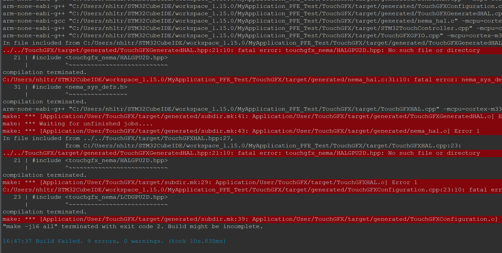
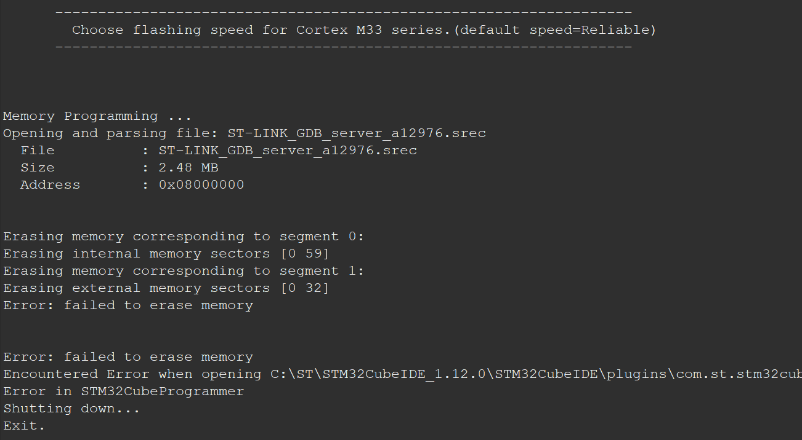

# Frequently Asked Questions

## General Questions

1. What is the purpose of this FAQ document?
    - Document any useful tips or debugging method/workaround.
2. How can I contribute to this FAQ?
    - Read and develop with the project, add your tech tip. Just the tip.
3. How often is this FAQ updated?
    - `¯\_(ツ)_/¯`

## Technical Questions

1. How can I redo the project from scratch?
    1. Design the UI in TouchGFX
        - Create New > By Partners > Riverdi_50STM32U5A9 (800 x 480)
    2. Generate code inside TouchGFX
    3. Open CubeMX and configure peripherals
    4. Generate code inside CubeMX
    5. Go back to TouchGFX and re-generate code inside TouchGFX
    6. Open CubeIDE and code
    7. Copy/Modify every files in the Developer Changelogs of the README
    8. Build
    9. Fix errors, if any.
    10. Profit???
  
2. When opening the .ioc, it ask me to update the firmware. What do I do?
    - When opening the .ioc (in CubeMX or CubeIDE), you will be prompted to migrate the .ioc to a newer version. (see image below) 
    - ALWAYS ANSWER <ins>**NO**</ins> (or "Continue to stay compatible blah blah blah...").
    - Updating the .ioc will also update some module (such as HALGPU2D) and some references will be broken. This issue is a TODO to be fix in the future.
  
3. How to fix "can't find HALGPU2D.hpp" compile error? 
    - 
    - Redo step 5 of Technical Questions #1
    - This happens because after configuring the .ioc, the code regeneration (by CubeIDE or CubeMX), overwrites some code of TouchGFX (I believe so...)
    - By regenerating the code from TouchGFX at the end, everything seems to magically fix itself `¯\_(ツ)_/¯`.
  
5. How to fix "cannot erase memory" error when flashing device?
   - 
    - I don't know either... `¯\_(ツ)_/¯`
    - But seriously, I'm trying to figure it out.
