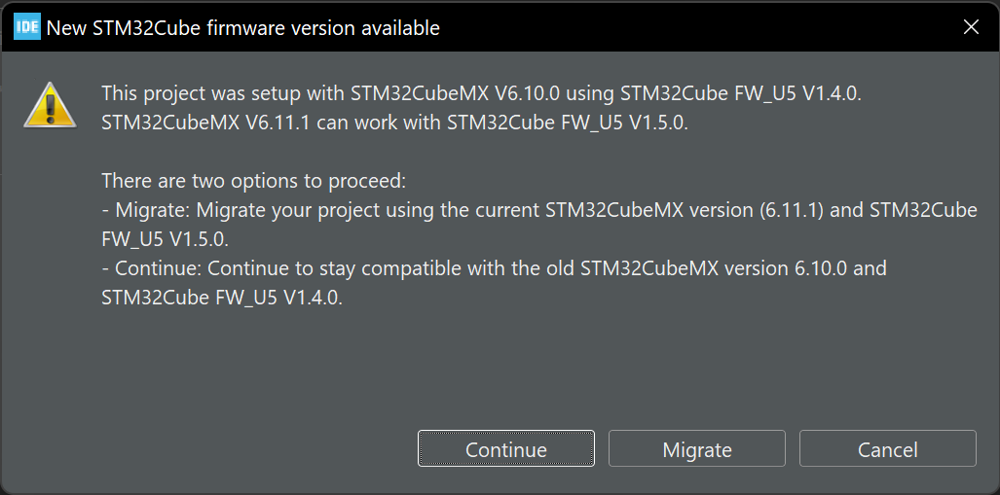

# ELE795 PFE H24

Founded in 2008, the Chinook student club at École des technologies supérieurs aims to design the world's fastest wind-powered car. Each year, the ÉTS team competes against teams from around the world to determine who builds the world's best vehicle. 

To ensure their chances of winning these competitions, the team of student volunteers optimizes the vehicle using their knowledge of mechanical and electrical engineering.  

This year, as part of their end-of-study project, two members of the Chinook team and two colleagues got together to undertake a major improvement to the wind-powered vehicle - the design of a new steering wheel with a new, improved graphic interface.  As part of this project, the team is responsible for designing a working virtual prototype of the new steering wheel, while meeting the club's expectations. 
To successfully complete this mandate, we need to use our previous engineering knowledge to model a working prototype in both software and hardware. 

> :warning: **WARNING** :warning:
>
> When opening the .ioc (in CubeMX or CubeIDE), you will be prompted to migrate the .ioc to a newer version. (see image below)
> 
> 
>
> ALWAYS ANSWER <ins>**NO**</ins> (or "Continue to stay compatible blah blah blah...").
>
> Updating the .ioc will also update some module (such as HALGPU2D) and some references will be broken.
>
> This issue is a TODO to be fix in the future.

## Objectives
1. Design a steering wheel using a microcontroller compatible with other components of the vehicle control system.
2. The steering wheel must communicate with the control system via CANBus.
3. Enhance the visual element of the steering wheel by integrating a screen of at least 5 inches to display various values readable by the driver.
4. Improve the ergonomics of the steering wheel by optimizing the location of the buttons and display. We need 8 to 12 push-buttons and 2 rotary encoders.

# Main components of the code
## TouchGFX
TouchGFX is a software framework developed by STMicroelectronics for creating modern graphical user interfaces (GUIs) for embedded systems. It is designed to be highly efficient and optimized for microcontroller-based platforms, particularly those with limited resources such as RAM and processing power.

TouchGFX generates code as part of its workflow for creating graphical user interfaces (GUIs) for embedded systems. When you design your GUI using TouchGFX Designer, it generates C++ code based on your design, which you can then integrate into your embedded application.

## STM32Cube IDE
STM32CubeIDE is an integrated development environment (IDE) developed by STMicroelectronics specifically for STM32 microcontroller-based projects. It provides a comprehensive set of tools for software development, including code editing, compilation, debugging, and project management, all within a single graphical user interface.

# Root file structure
### Core/
This is the main folder with all the libraries for the STM32 MCU to work. It includes function library such as `gpio.c`, `main.c`, `fdcan.c`, etc. and their header files. Your STM32Cube IDE will reference files from here to auto-generate the code.

### Drivers/
This is where you will find all HAL (Hardware Abstraction Layer) and BSP (Board Support Package) librairies. The STM32U5xx_HAL_Driver is located in here. There's nothing to modify in here.

### gcc/
This is all module used for compiling and building the projet. It includes the Riverdi (manufacturer) launch file used to flash the project (QSPI_STM32H747I-Riverdi-MICRON_V2.stldr). There's nothing to modify in here.

### Middlewares/
As the name suggest, this is where all the middlewares libraries used in this project is located. You will find the TouchGFX driver and components and the FreeRTOS module. There's nothing to modify in here.

### **STM32CubeIDE/**
This is the main workspace for the STM32CubeIDE. This is where most of the configuration will reside. You will find the main code developped for the project. This is where you code for the implementation.

### **TouchGFX/**
This folder is auto-generated and maintained/updated by TouchGFX Designer. It contains all the C++ code for the GUI. You can modify code here for the GUI, *if needed*.

### .gitignore
*self explanatory*

### Riverdi_50STM32U5A9.ioc
Main config file of the MCU for the project. Can be opened in CubeMX or will be referenced in the workspace by STM32CubeIDE.

# Methodology of development 
*How to develop, build and flash the code*

## 1. Design the GUI in TouchGFX
> Drag and drop element to design the UI. Add references for the code using Wildcards.

## 2. Generate the code
> Using the "Generate code" function of TouchGFX.

## 3. Configure the MCU
> Open the .ioc file in either CubeMX or CubeIDE to configure the MCU.

## 4. Generate the code
> Using CubeMX or CubeIDE, generate the code with the new configuration.

## 5. Develop / Integrate
> Add your code and integrate it with the GUI.

## 6. Build and flash
> Build your code and flash using the manufacturer .stldr file.

# Developer notes

- Use callback when possible
- Don't forget to set Wildcard character range in the Typography section of TouchGFX
- Don't forget to set External Debugger to the .stldr file
- CAN baud rate is 250 kbit/s

# Developer Changelogs

Files that has code made by human (me). So it'll be easier to find bugs when build/compile fails.

- main.c / main.h
    - inclure screen_tasks en haut du fichier
	- déclaration des task_handle
	- création des threads (osThreadNew)
- fdcan.c / fdcan.h
    - init fdcan
    - process_can
    - RX_Callback
    - EXTI_TX
    - variables globales
- stm32u5xx_it.c
    - Déclaration variable desired_screen
	- Bloc if-else dans EXTI3_IRQHandler
- screen_task.c / screen_task.h
    - Se trouve dans STM32CubeIDE/Application/User/application
- Model.cpp
    - Se trouve dans TouchGFX/gui/src
	- Copier tout le fichier
- UI_page1Presenter.cpp
	- Se trouve dans TouchGFX/gui/src
	- Tout ce qui est apres UI_page1Presenter::deactivate
- UI_page1View.cpp
	- Se trouve dans TouchGFX/gui/src
	- Tout ce qui est apres UI_page1View::tearDownScreen
- UI_page2Presenter.cpp
	- Se trouve dans TouchGFX/gui/src
	- Tout ce qui est apres UI_page2Presenter::deactivate
- UI_page2View.cpp
	- Se trouve dans TouchGFX/gui/src
	- Tout ce qui est apres UI_page2View::tearDownScreen
- Model.hpp
	- Se trouve dans TouchGFX/gui/include/gui/model
	- include stdint
	- variable curr_screen
- ModelListener.hpp
	- Se trouve dans TouchGFX/gui/include/gui/model
	- Deux fonctions virtual
- UI_page1Presenter.hpp
	- Se trouve dans TouchGFX/gui/include/gui/ui_page1_screen
	- Inclure screen tasks avec extern C
	- Deux fonctions virtual
- UI_page1View.hpp
	-  Se trouve dans TouchGFX/gui/include/gui/ui_page1_screen
	- Inclure screen tasks avec extern C
	- Les 7 fonctions virtual à partir de change_screen
- UI_page2Presenter.hpp
	- Se trouve dans TouchGFX/gui/include/gui/ui_page2_screen
	- Inclure screen tasks avec extern C
	- Deux fonctions virtual
- UI_page1View.hpp
	- Se trouve dans TouchGFX/gui/include/gui/ui_page2_screen
	- Inclure screen tasks avec extern C
	- Les 4 fonctions virtual à partir de change_screen

# TODO (Enhancements/Fixes)
- [ ] Skip polling for screen and push data directly to the queue from the callback
- [ ] Use callback for the screen change EXTI3
- [ ] Migrate project to newer .ioc version